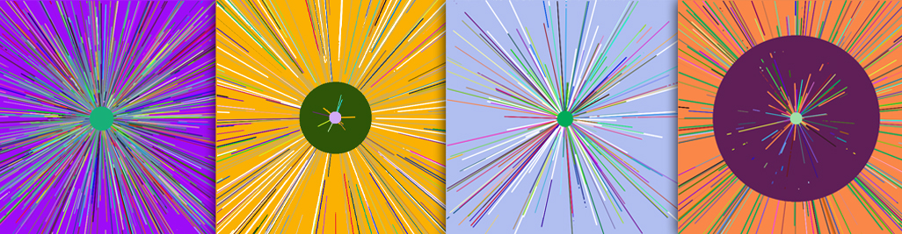

# Generative Art

This project showcases a generative art piece created using the Processing programming language. The artwork generates lines of colors from the center of the screen outward, with random directions and speeds. Each circle generated is stored in an array, and upon reaching the screen edge, they rebound with the same color. The central circle grows in size, clearing the content in its path. This process creates an ever-changing and visually captivating piece of generative art.

This artwork is a modest generative art endeavor showcased within the realm of creative programming in the multimedia degree curriculum.

## Key Features

- **Mouse Wheel Control**: By using the mouse wheel, you can modify the rate of line generation at the center of the screen. This interactive element allows you to experiment with different levels of complexity in the artwork.

- **Modifiable Variables**: The code includes adjustable variables such as `circleGeneration`, `growthRate`, and more, which allow you to fine-tune various aspects of the generative art. These variables are commented in the code, making customization easy even for those with limited programming experience.

## Getting Started

1. **Clone the Repository:** Clone this repository to your local machine using the following command:
  git clone https://github.com/mirtor/GenerativeArt.git

2. **Requirements:** Make sure you have Processing 4.2 installed on your machine to run the project correctly.

3. **Run the Game:** Open the project in Processing and run. Ensure that all dependencies are loaded and up to date.

4. **Controls:** Use mouse wheel control and modify the variables.

## Support

If you need help or have any questions, you can contact Víctor Díaz via [email](mailto:victor.diaz.iglesias@gmail.com) for assistance.

## Contribution

This project is maintained and improved thanks to contributions from the developer community. If you'd like to contribute, follow these steps:

1. Fork the repository.
2. Create a branch for your contribution: `git checkout -b new-feature`
3. Make your changes and commit them: `git commit -m "Add a new feature"`
4. Push the branch: `git push origin new-feature`
5. Open a Pull Request on GitHub.

## Credits

- Developer: Víctor Díaz Iglesias

## Resources and References

- Processing. (n.d.). Retrieved from https://processing.org/
